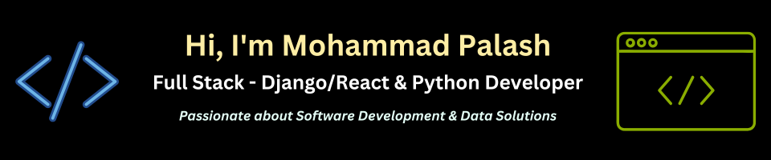

👋 Hi there! I'm Mohammad Palash, a Python Developer specializing in full-stack Django/DRF and React development, alongside web scraping, automation, and data extraction. With a dedication to crafting efficient and scalable solutions, I thrive on challenges and am committed to delivering top-notch quality results.

🚀 **What I bring to the table:**

- ✔️ Proficiency in Python, Node.js, Django, Django REST Framework, React, Scrapy, Selenium, Puppeteer, Playwright, Docker, and AWS.
  
- ✔️ Extensive experience in developing full-stack Django/React web applications, ensuring scalability, efficiency, and dynamic user experiences.
  
- ✔️ Expertise in API development with Django Rest Framework, building high-performance endpoints for seamless integration.
  
- ✔️ Skilled in React for building dynamic user interfaces and seamless client-side experiences.

- ✔️ Deployment expertise on cloud platforms including Heroku, DigitalOcean, and AWS for scalable solutions.

- ✔️ Extensive experience in web scraping, automation, and data extraction, ensuring accurate and reliable results.

- ✔️ Advanced knowledge of database management systems like PostgreSQL, MySQL, and MongoDB, ensuring data integrity and efficiency.

💡 **Let's collaborate on your full-stack Django/React and data-driven projects!** Whether you need a Django/React app, web scraping solutions, or API endpoints, I'm here to turn your vision into reality. Feel free to reach out for discussions and project exploration. I'm committed to exceeding your expectations every step of the way.

🌱 **I’m currently working as a freelancer on Upwork and continuously expanding my skills!**
