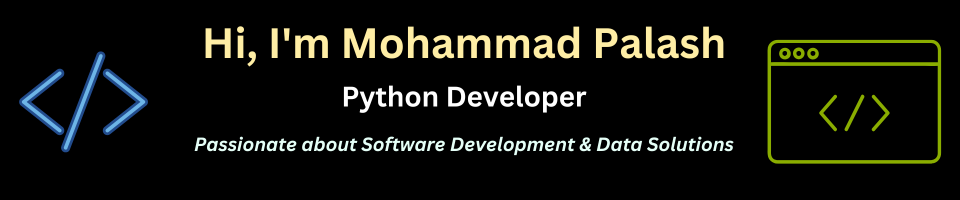

𝗣𝘆𝘁𝗵𝗼𝗻 𝗗𝗲𝘃𝗲𝗹𝗼𝗽𝗲𝗿 | 𝗪𝗲𝗯 𝗦𝗰𝗿𝗮𝗽𝗶𝗻𝗴 & 𝗔𝘂𝘁𝗼𝗺𝗮𝘁𝗶𝗼𝗻 | 
𝗘𝘅𝘁𝗿𝗮𝗰𝘁𝘀 𝘃𝗮𝗹𝘂𝗮𝗯𝗹𝗲 𝗱𝗮𝘁𝗮 𝗳𝗿𝗼𝗺 𝘄𝗲𝗯𝘀𝗶𝘁𝗲𝘀 and automates workflows using Python (Scrapy, Selenium). Expertise in Django/React for full-stack development.

𝗔𝗱𝗱𝗶𝘁𝗶𝗼𝗻𝗮𝗹 𝗦𝗸𝗶𝗹𝗹𝘀: Django/DRF, React, Node.js, Docker, AWS, Databases (PostgreSQL, MySQL, MongoDB).

𝗖𝗼𝗻𝗻𝗲𝗰𝘁 & 𝗖𝗼𝗹𝗹𝗮𝗯𝗼𝗿𝗮𝘁𝗲: Open to discussions on full-stack & data-driven projects.

𝗙𝗿𝗲𝗲𝗹𝗮𝗻𝗰𝗲𝗿 (Upwork) | Continuous learner
