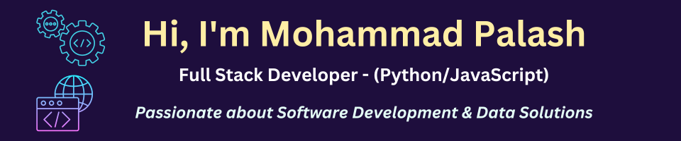

𝗪𝗲𝗯 𝗦𝗰𝗿𝗮𝗽𝗶𝗻𝗴 & 𝗔𝘂𝘁𝗼𝗺𝗮𝘁𝗶𝗼𝗻 𝗦𝗽𝗲𝗰𝗶𝗮𝗹𝗶𝘀𝘁 | 𝗣𝘆𝘁𝗵𝗼𝗻, 𝗦𝗰𝗿𝗮𝗽𝘆, 𝗦𝗲𝗹𝗲𝗻𝗶𝘂𝗺, 𝗖𝗹𝗼𝘂𝗱 𝗗𝗲𝗽𝗹𝗼𝘆𝗺𝗲𝗻𝘁
I specialize in data extraction, large-scale web scraping, and automation, helping businesses streamline workflows with custom scraping solutions. Whether it's structured data for market research, AI/ML training, or lead generation, I build efficient, undetectable, and scalable scrapers.

🔹 Core Expertise:
𝗔𝗱𝘃𝗮𝗻𝗰𝗲𝗱 𝗪𝗲𝗯 𝗦𝗰𝗿𝗮𝗽𝗶𝗻𝗴: Scrapy, Selenium, Playwright, Puppeteer
𝗗𝗮𝘁𝗮 𝗘𝘅𝘁𝗿𝗮𝗰𝘁𝗶𝗼𝗻 & 𝗜𝗻𝘁𝗲𝗴𝗿𝗮𝘁𝗶𝗼𝗻: APIs, PostgreSQL, MySQL, MongoDB
𝗔𝗻𝘁𝗶-𝗕𝗹𝗼𝗰𝗸𝗶𝗻𝗴 & 𝗖𝗮𝗽𝘁𝗰𝗵𝗮 𝗕𝘆𝗽𝗮𝘀𝘀: Rotating proxies, session handling, TLS fingerprinting
𝗦𝗰𝗮𝗹𝗮𝗯𝗹𝗲 𝗖𝗹𝗼𝘂𝗱 𝗗𝗲𝗽𝗹𝗼𝘆𝗺𝗲𝗻𝘁: AWS Lambda, Google Cloud Run, Docker
𝗔𝘂𝘁𝗼𝗺𝗮𝘁𝗶𝗼𝗻 & 𝗘𝘁𝗟 𝗣𝗶𝗽𝗲𝗹𝗶𝗻𝗲𝘀: Celery, Cron Jobs, S3

🔹 Why Work With Me?
✅ Undetectable & High-Success Scraping for dynamic sites
✅ Optimized, Scalable & Cloud-Ready Solutions
✅ Secure & Ethical Data Collection
✅ Custom APIs & Automated Pipelines

I'm open to collaborations on data extraction, automation, and cloud scraping projects.
📩 Let’s connect and discuss how I can help streamline your data needs! 🚀
